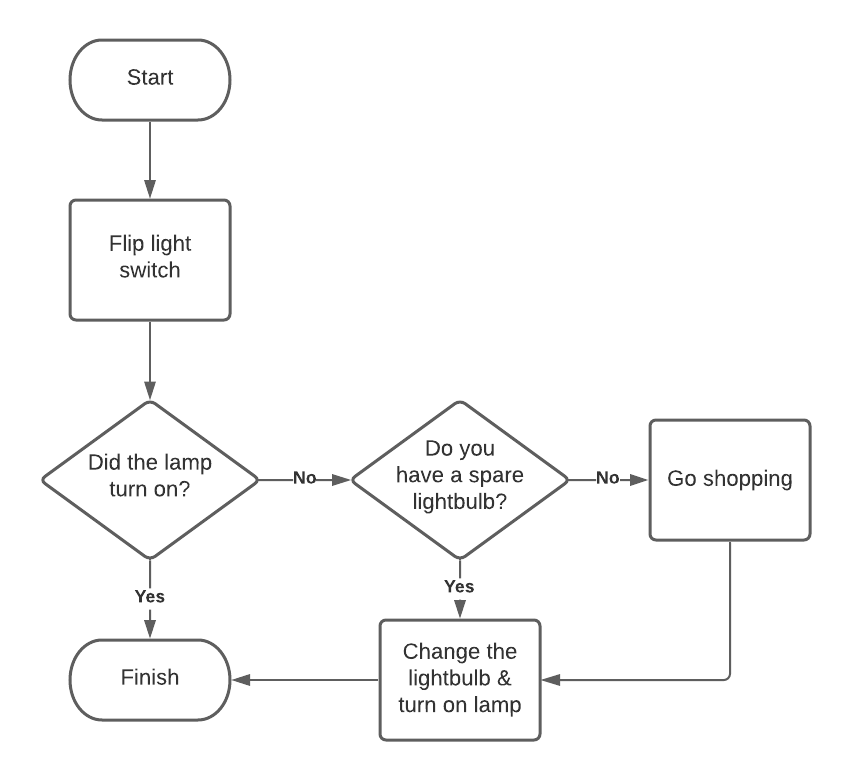
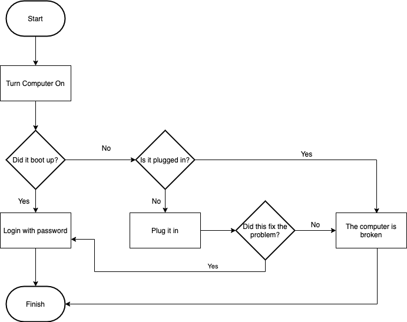

# Control Flow/Conditionals Lab

**Lab Duration: 60 minutes**

## Learning Objectives

- Practice translating a flowchart into code
- Practice pseudocode
- Practice conditional logic

## Task 1

Write a Python program based on the following flowchart.

### Brief

- All "procedure" symbols (rectangles) should be represented as `print` statements within your program.
- All "decision" symbols (diamonds) will require you take take input from the user, using `input`, and make a decision within your program using an `if` statement.

### Getting Started

1. Create a new file called `lamp_troubleshooting.py`
2. Write pseudocode based on the flowchart
3. Translate your pseudocode into working Python code

## Task 2

Write a Python program based on the following flowchart. 

### Brief

- All "procedure" symbols (rectangles) should be represented as `print` statements within your program.
- All "decision" symbols (diamonds) will require you take take input from the user, using `input`, and make a decision within your program using an `if` statement.

### Getting Started

1. Create a new file called `computer_troubleshooting.py`
2. Write pseudocode based on the flowchart
3. Translate your pseudocode into working Python code
